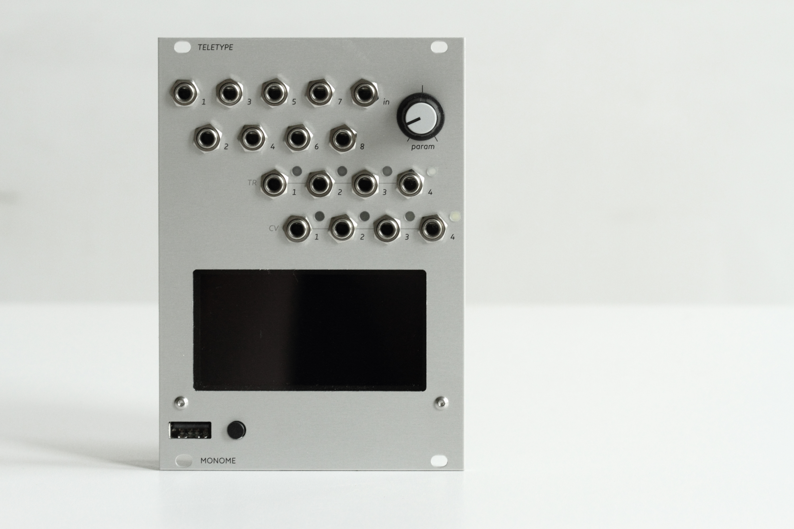

# teletype hardware

eurorack module by https://monome.org

created by brian crabtree (bcrabtree@monome.org)

all circuits in eagle. can be imported to kicad.

firmware: https://github.com/monome/teletype

## BOM

- components: see ods
- octopart: https://octopart.com/bom-tool/cjqXTx5c
- mechanical (screws and spacers)
  - mcmaster: 91780A023, 91772A077, 91772A073

## license

(cc-by-sa-3.0](https://creativecommons.org/licenses/by-sa/4.0/)

commerical use: send $10 per unit produced to tehn@nnnnnnnn.co via paypal

do not use the name "monome" or "teletype" in derivative works.

## warranty and support

we can provide neither

## thank you

everyone who helped this module live
